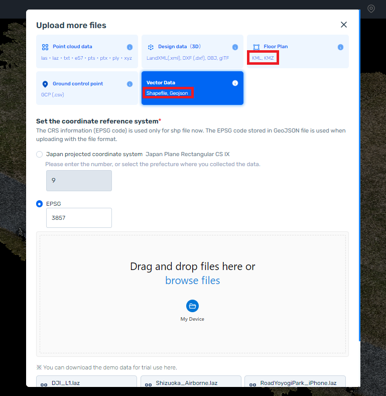

# Write Shape file and kml file using MATLAB (medium)

# 1. Introduction

MATLAB Mobile is an application that allows you to run MATLAB using your smartphone or tablet. With this application, you can easily use MATLAB for data processing and data visualization without using a PC.


Reference: MATLAB Mobile ([https://www.mathworks.com/products/matlab-mobile.html](https://www.mathworks.com/products/matlab-mobile.html))

In this post, I will use MATLAB Mobile to record the trajectory of a taxi during movement and save the information in longitude and latitude. Then, I will use MATLAB to save the longitude and latitude information as shape files and kml files. Finally, these files will be imported into an online point cloud processing software called ScanX for visualization.

Next, we will explain the specific steps in detail.

# 2. How to obtain location information using MATLAB Mobile

In chapter 2, we will discuss how to use MATLAB Mobile, installed on smartphones or tablets, to save location information while on the move.

However, the data I obtained has been uploaded to the following page. If you want to write shape files or kml files, please download the `.mat` file of longitude and latitude from the following page. In that case, you do not need to read chapter 2.

[https://github.com/KentaItakura/write-shp-and-kml-file-using-MATLAB](https://github.com/KentaItakura/write-shp-and-kml-file-using-MATLAB)

## 2.1. Installing MATLAB Mobile

You can find the link to install MATLAB Mobile on the following page:

[https://www.mathworks.com/products/matlab-mobile.html](https://www.mathworks.com/products/matlab-mobile.html)

Please install it on your smartphone or tablet.

## 2.2. Acquiring Sensor Data using MATLAB Mobile

MATLAB, one of the [programming languages](http://d.hatena.ne.jp/keyword/%A5%D7%A5%ED%A5%B0%A5%E9%A5%DF%A5%F3%A5%B0%B8%C0%B8%EC), is a paid software, but an app that can run on [smartphones](http://d.hatena.ne.jp/keyword/%A5%B9%A5%DE%A1%BC%A5%C8%A5%D5%A5%A9%A5%F3) or tables called MATLAB Mobile is also available. By creating an account, you can use some of its features for free.

Among them, the function to acquire [t](http://d.hatena.ne.jp/keyword/%A5%B9%A5%DE%A1%BC%A5%C8%A5%D5%A5%A9%A5%F3)he sensor data (acceleration, magnetic field, position, etc.) is interesting, and I wanted to try playing with it.

For example, by opening MATLAB Mobile downloaded on iPhone and following the steps below, you can easily acquire sensor data. Here, we are measuring information such as acceleration.


## 2.3. Acquisition of Sensor Data with MATLAB Mobile

This section describes how to acquire data using MATLAB Mobile. The acquired data is saved on a storage service called MATLAB Drive, similar to Google Drive or Dropbox. With the free version, you can save up to 5GB for free until March 2023.

[MATLAB Drive](https://www.mathworks.com/products/matlab-drive.html)

Please follow the steps below to acquire the data. 

1. Set the stream destination to "log" (do not send it to the cloud in real-time).
2. Reduce the sampling rate to a low frequency (e.g. 1 Hz) to minimize data acquisition frequency, as detailed movement logs are not necessary for this case
3. Turn on location information.
4. Press the start button.
5. Stop the measurement when it is finished (this measurement is very short).
6. A red "1" is visible in the sensor log: wait a while, and it will be sent to the cloud (MATLAB Drive).


Instructions on how to retrieve location information using MATLAB Mobile are also provided on this page as well:

[https://kentapt.hatenablog.com/entry/2021/10/11/111320](https://kentapt.hatenablog.com/entry/2021/10/11/111320)

After obtaining the data, please download it to your PC. Additionally, if you execute the code in chapter 3 on MATLAB Online, you can process it online without having to download any files.

# 3. Writing shape and kml files in MATLAB

In order to run the code in Chapter 3, MATLAB and the Mapping Toolbox are required.

Shape files can be saved using the `shapewrite` function.

[Write geographic vector data structure to shapefile - MATLAB shapewrite](https://www.mathworks.com/help/map/ref/shapewrite.html)

In writing the shape file, it is necessary to store not only longitude and latitude information but also "Geometry" and "Name" information in a structure variable. I searched MATLAB documentation but couldn't find a way to save shapefiles from scratch.

In addition, kml files can be easily saved using the `kmlwriteline` function. With the `kmlwriteline` function, it is possible to easily save not only the longitude and latitude but also altitude.

[Write geographic line data to KML file - MATLAB kmlwriteline](https://www.mathworks.com/help/map/ref/kmlwriteline.html?searchHighlight=kmlwriteline&s_tid=srchtitle_kmlwriteline_1)

Below is the code for saving shape and kml files. The code is also saved in the GitHub repository. mentioned in chapter 2. Feel free to download to use it.

```matlab
clear; clc; close all % Clears existing variables, clears command window and closes all figures.

%% Load the data
inFile = 'data.mat'; % Specify the name of the .mat file containing the data.
load(inFile) % Load data from the file.

%% Store latlon and altitude info 
lat = Position.latitude; % Store latitude information in the variable 'lat'.
lon = Position.longitude; % Store longitude information in the variable 'lon'.
alt = Position.altitude; % Store altitude information in the variable 'alt'.

%% Write Shp file
n = size(lat, 1); % Store the number of rows in the latitude information in the variable 'n'.
S(n).Geometry = 'Point'; % Create an array of Shape objects with point geometry.
for i = 1:n % Iterate and store values in the S array.
    S(i).Lat = lat(i); % store lat info 
    S(i).Lon = lon(i); % store lon info 
    S(i).Geometry = 'Point';
    S(i).Name = 'Point';
end
shapewrite(S, 'point.shp'); % Write the Shape file.

%% Write KML file
filename = 'point.kml'; % Specify the name of the KML file.
kmlwriteline(filename, lat, lon, alt, 'Color', 'red', 'LineWidth', 5); % Write the line segment to the KML file.
```

When you run the above code, you will see that the shape files (.shp, .shx, .dbx) and kml files are saved.

# 4. Upload to ScanX and visualize the trajectory

In this chapter, we will visualize the shape file and kml file saved in Chapter 3 using the online 3D point cloud software, ScanX. For more information about ScanX, please visit the following page:

[https://global.scanx.jp/](https://global.scanx.jp/)

However, this post will not provide an explanation on how to use ScanX. In order to import shape files and kml files into ScanX, please click on the plus button as shown in the figure below.


When you click on it, an icon for importing shape files or kml files will be displayed. Set the EPSG code and complete the import. For detailed instructions, please refer to the ScanX user manual.



The following figure shows the result when importing a shape file into ScanX. The trajectory of the movement by taxi is visualized.


Here are the results when importing a kml file in the same way.

In Chapter 3, we saved the color of the lines in the kml file as red using the following code:

`kmlwriteline(filename, lat, lon, alt, 'Color', 'red', 'LineWidth', 5);`

As shown in ScanX, the lines are actually displayed in red.


# 5. Summary

This article explained how to use MATLAB Mobile to record the trajectory during taxi travel and save the longitude and latitude information as shape and kml files using MATLAB.

Also, the saved files were imported into the online-based point cloud processing software ScanX to visualized them. The data was displayed well on a 3D map called a base map like a globe.